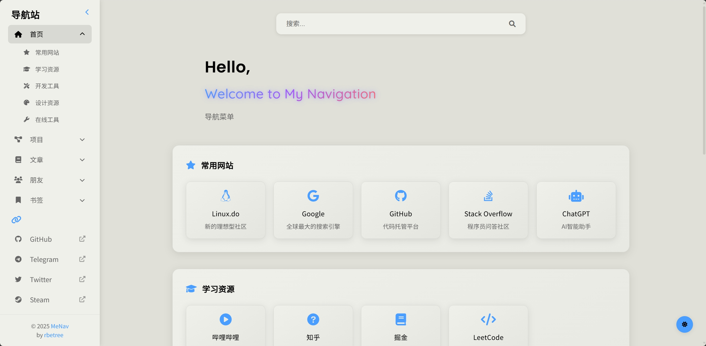

<div align="center">
  
  <h1>MeNav</h1>
  <p>
    一个轻量的个人导航网站
  </p>
</div>


[](https://www.gnu.org/licenses/agpl-3.0.html)
[](https://github.com/rbetree/menav/stargazers)
[](https://github.com/rbetree/menav/network/members)

📋 静态一键部署 | ⚡ 自动化构建 | 🔖 支持书签导入

> MeNav 是一个轻量级、高度可定制的个人导航网站生成器，让您轻松创建属于自己的导航主页。无需数据库和后端服务，完全静态部署，支持一键 Fork 部署到 GitHub Pages，还可以从浏览器书签一键导入网站。配合 [MarksVault](https://github.com/rbetree/MarksVault) 浏览器扩展，更支持书签自动同步和导航站自动更新。

如果觉得项目有用，欢迎 Star/Fork 支持，谢谢！

[直接开始部署>>](#部署方式)

## 预览

[在线访问](https://rbetree.github.io/menav/)

<p align="center">
  
  
</p>

## 特点

- 简洁美观的响应式布局设计
- 集成外部搜索引擎
- 分类展示网站链接
- 模块化配置
- 支持从浏览器导入书签
- 支持2-4层级的多层级嵌套结构
- 与 [MarksVault](https://github.com/rbetree/MarksVault) 浏览器扩展集成，支持自动推送书签
- 可部署到GitHub Pages或任何类似的CI/CD服务

## 更新记录

<details>
<summary>点击查看/隐藏更新日志</summary>

### 2025/12/23

**1. 侧边栏与导航交互优化**
- 高亮项有子菜单时会自动展开
- 侧边栏 `logo_text` 左侧展示站点 Logo（复用 `site.favicon`）

**2. 卡片层级折叠规则调整**
- 仅 1 层分类：一级分类支持下拉/收起
- 2/3 层分类：仅二级标题支持下拉/收起（一级/三级不提供折叠按钮与交互）

**3.页面细节**
- 主题蓝调整为 `#7694B9`，统一应用到高亮/渐变/阴影
- 搜索无结果红色状态图标对齐修复（避免图标位置偏移）
- `menav.svg` 优化暗色背景可读性（字母颜色加深）

### 2025/11/09

**1. 默认配置与文档**
- 更新默认配置与项目 Logo，并同步完善 README

### 2025/10/31

**1. 书签导入与嵌套结构**
- 优化书签转换逻辑与分类嵌套结构
- 修复书签转换脚本问题，提升稳定性

### 2025/10/24 - 2025/10/27

**1. 分类/卡片交互与细节修复**
- 为各结构补齐下拉指示与交互，并新增“分类展开/收起”按钮
- 修复侧边栏切换图标错位、站点卡片悬浮层级遮挡问题
- 调整卡片间距与 category/group 栏样式效果，移除废弃的 `restructure` 命令

### 2025/10/18

**1. 图标模式默认行为变更**
- 默认启用 `icons.mode: favicon`，自动根据站点 URL 加载 favicon（失败回退为 Font Awesome 图标）
- 如需关闭外部请求并完全使用手动图标，请在 `config/user/site.yml` 中设置：

```yaml
# config/user/site.yml
icons:
  mode: manual  # 关闭 favicon 请求，纯手动图标
```

### 2025/10/14

**1. 拼音搜索支持**

- 支持中文拼音与首字母匹配检索（基于 `pinyin-match`）

### 2025/07/30

**1. 链接打开行为一致性**
- 统一站点/导航外链为新标签页打开，改善导航体验

### 2025/07/07

**1. UI 细节优化**

- 侧边栏显示与布局细节优化
- 明暗主题切换按钮样式改进
- 欢迎文本与布局对齐优化

### 2025/05/22

**1. MeNav 浏览器扩展支持接口**
- 注入序列化的配置数据供扩展读取（`configJSON`）
- 暴露 `window.MeNav` 基础能力与 DOM 数据属性，支持元素精准定位与更新
- 为扩展推送与页面联动打通基础能力

### 2025/05/16

**1. MarksVault 浏览器扩展集成**
- 支持与 [MarksVault](https://github.com/rbetree/MarksVault) 浏览器扩展集成
- 使用扩展自动推送书签文件到 MeNav
- 自动处理推送的书签文件并更新网站

### 2025/05/09

**1. 搜索引擎集成功能**
- 集成Google、Bing、百度搜索引擎
- 通过搜索框图标一键切换不同搜索引擎
- 用户选择保存在本地，下次访问自动应用

### 2025/05/08

**1. Handlebars模板系统重构**
- 使用Handlebars模板引擎重构整个前端生成系统
- 实现模块化、组件化的模板结构，包含layouts、pages和components
- 改进代码复用，提高可维护性和扩展性
- 优化HTML生成逻辑，提升性能和代码质量

### 2025/05/04

**1. 移除双文件配置支持**
- 完全移除了对双文件配置方法的支持
- 简化了配置加载逻辑，现在仅支持模块化配置

### 2025/05/03

**1. 侧边栏收回功能**
- 添加侧边栏折叠/展开按钮，位于Logo文本右侧
- 侧边栏平滑折叠/展开过渡

**2. 移动端UI优化**
- 修复搜索按钮和侧边栏按钮遮挡问题
- 点击侧边栏导航项后自动收起侧边栏

### 2025/05/02

**1. 模块化配置**
- 支持将配置拆分为多个文件，便于管理和维护
- 引入配置目录结构，分离页面配置
- 配置统一采用模块化目录结构（`config/user/` / `config/_default/`）

### 2025/05/01

**1. 页面布局优化**
- 优化了内容区域和侧边栏的间距，确保各种分辨率下内容不会贴近边缘
- 卡片与边框始终保持合理间距，避免在窄屏设备上与滚动条贴边
- 调整了搜索结果区域的边距，与常规分类保持样式一致性

**2. 网站卡片文本优化**
- 为站点卡片标题添加单行文本截断，过长标题显示省略号
- 为站点描述添加两行限制和省略号，保持卡片布局整洁
- 添加卡片悬停提示，方便查看完整信息

**3. 移动端显示增强**
- 优化了移动端卡片尺寸，一屏可显示更多网址
- 图标大小自适应，在小屏幕上更加紧凑
- 为不同尺寸移动设备（768px、480px、400px）提供递进式UI优化
- 减小卡片内边距和元素间距，增加屏幕利用率

**4. 书签导入功能**
- 支持从Chrome、Firefox和Edge浏览器导入HTML格式书签
- 自动处理书签文件，解析文件夹结构和链接
- 图标处理：默认加载站点 favicon；在 manual 模式下保留 Font Awesome 匹配
- 生成配置文件，无需手动录入即可批量导入网站链接
- 与GitHub Actions集成，全自动化的导入和部署流程

</details>

## 技术栈

- HTML5 + CSS3
- JavaScript (原生)
- Handlebars 模板引擎
- Google Favicon API + Font Awesome 图标

## 项目结构

```text
menav/
├── src/        # 生成器、书签处理、前端脚本（入口：src/generator.js）
├── templates/  # Handlebars 模板（layouts/pages/components）
├── config/     # 模块化配置
├── assets/     # 静态资源
├── bookmarks/  # 书签导入相关
└── dist/       # 构建产物
```

## 文档导航

- 配置系统（完全替换策略、目录结构、示例）：[`config/README.md`](config/README.md)
- 书签导入（格式要求、流程、常见问题）：[`bookmarks/README.md`](bookmarks/README.md)
- 模板系统（组件、回退、数据流）：[`templates/README.md`](templates/README.md)
- 源码结构（各脚本职责）：[`src/README.md`](src/README.md)
- Handlebars helpers（模板辅助函数）：[`src/helpers/README.md`](src/helpers/README.md)
- 静态资源（样式/图片等）：[`assets/README.md`](assets/README.md)

## 快速开始

用于本地开发预览与构建静态站点；在线部署见 [部署方式](#部署方式)。

<details>
<summary>点击展开</summary>

通过以下步骤快速设置您的个人导航站：

1. 克隆仓库
```bash
git clone https://github.com/rbetree/menav.git
cd menav
```

2. 安装依赖
```bash
# 安装依赖
npm install
```
（本仓库的 GitHub Actions/CI 已改为使用 `npm ci`，以获得更稳定、可复现的依赖安装（基于 `package-lock.json`）；本地开发可继续使用 `npm install`，也可直接使用 `npm ci`。）

3. 完成配置（见[设置配置文件](#设置配置文件)）
   
4. 导入书签（可选）
   - 将浏览器导出的HTML格式书签文件放入`bookmarks`目录
   - 运行书签处理命令：
   ```bash
   npm run import-bookmarks
   ```
   - 若希望生成结果保持确定性（便于版本管理，减少时间戳导致的无意义 diff）：
   ```bash
   MENAV_BOOKMARKS_DETERMINISTIC=1 npm run import-bookmarks
   ```
   - 系统会自动将书签转换为配置文件保存到`config/user/pages/bookmarks.yml`
  - **注意**：`npm run dev`命令不会自动处理书签文件，必须先手动运行上述命令
  - `npm run dev` 默认会刷新 `articles/projects` 的联网缓存（若你希望离线启动，请使用 `npm run dev:offline`）

5. 构建
```bash
# 启动开发服务器
npm run dev
```

```bash
# 离线启动开发服务器（不刷新联网缓存）
npm run dev:offline
```

```bash
# 生成静态HTML文件
npm run build
```

构建后的文件位于`dist`目录

6. 提交前检查（推荐）

```bash
# 一键检查（语法检查 + 单元测试 + 构建）
npm run check
```

（可选）格式化代码：

```bash
npm run format
```

</details>

## 部署方式

用于将生成的静态站点发布到 服务器 or CI/CD；本地构建见 [快速开始](#快速开始)。

### 快速部署到GitHub Pages

<details>
<summary>点击展开</summary>

#### 第一步：前置设置

1. Fork仓库:
   - 点击右上角的 Fork 按钮复制此仓库到您的账号

2. 启用Actions:
   - 进入fork后的仓库
   - 点击顶部的 "Actions" 标签页
   - 点击绿色按钮 "I understand my workflows, go ahead and enable them"

3. 配置Pages:
   - 进入仓库的 Settings -> Pages
   - 在 "Build and deployment" 部分
   - Source: 选择 "GitHub Actions"

#### 第二步：自定义配置

创建个人配置文件:
- **重要:** 始终创建自己的用户配置文件，不要直接修改默认配置文件
- 完成配置文件（见[设置配置文件](#设置配置文件)）
- 提交您的配置文件到仓库

#### 第三步：等待自动部署

- GitHub Actions会自动检测您的更改
- 构建并部署您的网站
- 部署完成后，您可以在 Settings -> Pages 中找到您的网站地址
  - 站点内容的“时效性数据”（RSS 文章聚合、projects 仓库统计）会由部署工作流在构建前自动刷新
  - 也支持定时刷新：默认每天 UTC 02:00 触发一次（GitHub Actions cron 使用 UTC；北京时间=UTC+8，可在 `.github/workflows/deploy.yml` 中调整 `schedule.cron`）

**重要: Sync fork后需要手动触发工作流**:

- 当您使用GitHub界面上的"Sync fork"按钮同步本仓库的更新后
- GitHub Actions工作流不会自动运行
- 您需要手动触发构建流程:
  - 进入 Actions 标签页
  - 选择左侧的 "Build and Deploy" 工作流
  - 点击 "Run workflow" 按钮

</details>

### 部署到服务器

<details>
<summary>点击展开</summary>

如果您想部署到自己的Web服务器，只需要以下几个步骤：

1. 构建静态网站:
```bash
npm run build
```

2. 复制构建结果:
   - 所有生成的静态文件都位于 `dist` 目录中
   - 将 `dist` 目录中的所有文件复制到您的Web服务器根目录

3. 配置Web服务器:
   - 确保服务器配置为提供静态文件
   - 对于Apache: 在网站根目录中已有正确的 .htaccess 文件
   - 对于Nginx: 添加以下配置到您的server块:

```nginx
server {
    listen 80;
    server_name your-domain.com;
    root /path/to/dist;
    index index.html;

    location / {
        try_files $uri $uri/ /index.html;
    }
}
```

4. 更新配置:
   - 如果您想在服务器上更新网站，只需重复上述步骤1-2
   - 或者设置自动部署流程，例如使用GitLab CI/CD或Jenkins

</details>

### 其他CI/CD托管选项

<details>
<summary>点击展开</summary>

除了GitHub Pages外，您还可以使用其他各种CI/CD服务部署MeNav：

**如 Vercel / Netlify / Cloudflare Pages**:

- 连接您的GitHub仓库
- 设置构建命令为`npm run build`
- 设置输出目录为`dist`

> 如果你希望在构建时刷新“时效性数据”（RSS 文章聚合、projects 仓库统计），请将构建命令改为：
>
> ```bash
> npm ci && npm run sync-projects && npm run sync-articles && npm run build
> ```
>
> 说明：`sync-*` 会联网抓取并写入 `dev/` 缓存（仓库默认 gitignore）；同步脚本为 best-effort，失败不会阻断后续 `build`。
>
> 备注：`dev/` 只用于构建过程的中间缓存，默认不会被提交到仓库；部署时也只会上传 `dist/`，不会包含 `dev/`。

> **书签转换依赖 GitHub Actions**
> 如果需要使用书签自动推送功能，必须先在 GitHub 仓库中启用 GitHub Actions
> 
> **部署流程**：
>    ```
>    1. 上传书签 → 2. GitHub Actions 处理 → 3. 使用处理完成的代码在 GitHub Pages 自动部署
>                               ↓
>              4. 其他 CI/CD 托管平台检测到变化 → 5. 使用处理完成的代码自动部署
>    ```

无论选择哪种部署方式，请确保创建并使用您自己的配置文件，而不是直接修改默认配置。

</details>

## 设置配置文件

MeNav 使用模块化配置方式，将配置分散到多个 YAML 文件中，更易于管理和维护。

完整说明请直接看：[`config/README.md`](config/README.md)（以该文档为准）。

> **🔔 重要提示：** 请务必在`config/user/`目录下创建并使用您自己的配置文件，不要直接修改默认配置文件，以便后续更新项目时不会丢失您的个性化设置。

在加载配置时遵循以下优先级顺序：
1. `config/user/` （用户配置）（优先级最高）
2. `config/_default/` （默认配置）

**注意：** 采用完全替换策略，而非合并。系统会选择存在的用户配置，完全忽略默认配置。

### 最小可用配置（快速指引）

- 首次使用建议先完整复制 `config/_default/` 到 `config/user/`，再按需修改（因为配置采用“完全替换”策略，不会从默认配置补齐缺失项）。
- 至少需要有 `config/user/site.yml`（缺失时构建会直接报错退出，避免生成空白站点）。

## 书签导入功能

MeNav 支持从浏览器导入书签，快速批量添加网站链接；也支持与 MarksVault 扩展集成自动同步。

完整说明请直接看：[`bookmarks/README.md`](bookmarks/README.md)（以该文档为准）。

## 常见问题

<details>
<summary>如何自定义Handlebars模板？</summary>
模板系统完整说明请见：[`templates/README.md`](templates/README.md)。
</details>

<details>
<summary>导入的书签没有正确显示图标怎么办？</summary>
默认启用 favicon 模式：页面会尝试从第三方服务获取站点 favicon；若 URL 不是 http/https、站点无 favicon 或网络受限，将自动回退为 Font Awesome 图标。
</details>

<details>
<summary>如何使用MarksVault扩展自动同步书签？</summary>
MarksVault 扩展集成的完整说明请见：[`bookmarks/README.md`](bookmarks/README.md) 的 “MarksVault 扩展集成” 章节。
</details>

## Star-History

[](https://www.star-history.com/#rbetree/menav&Date)
