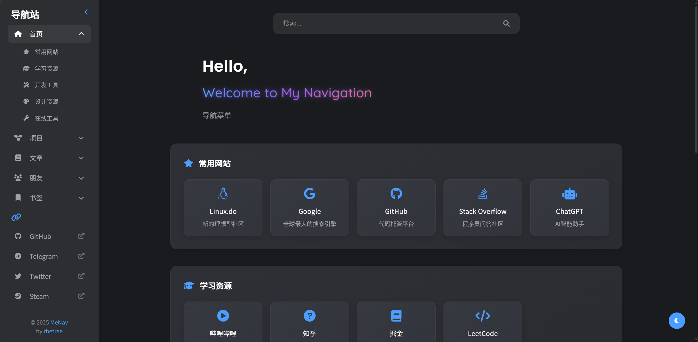

<div align="center">
  
  <h1>MeNav - 个人导航站</h1>
  <p>
    一个轻量级、高度可定制的个人导航网站
    <br />
    <i>⚡ 一键部署 自动化构建</i>
  </p>
</div>


[](https://www.gnu.org/licenses/agpl-3.0.html)
[](https://github.com/rbetree/menav/stargazers)
[](https://github.com/rbetree/menav/network/members)

📋 静态一键部署 | ⚡ 自动化构建 | 🔖 支持书签导入

> MeNav是一个轻量级、高度可定制的个人导航网站生成器，让您轻松创建属于自己的导航主页。无需数据库和后端服务，完全静态部署，支持一键Fork部署到GitHub Pages，还可以从浏览器书签一键导入网站。配合 [MarksVault](https://github.com/rbetree/MarksVault) 浏览器扩展，更支持书签自动同步和导航站自动更新。MeNav is a lightweight, highly customizable personal navigation website generator. One-click deployment to GitHub Pages, automated build, bookmark import support, and more.

如果觉得项目有用，欢迎⭐Star/Fork支持，谢谢！


## 预览

<table>
  <tr>
    <td><b>明亮主题</b></td>
    <td><b>黑暗主题</b></td>
  </tr>
  <tr>
    <td></td>
    <td></td>
  </tr>
</table>

## 目录

- [预览](#预览--preview)
- [功能特点](#功能特点)
- [近期更新](#近期更新)
- [技术栈](#技术栈)
- [项目结构](#项目结构)
- [快速开始](#快速开始)
- [部署方式](#部署方式)
  - [部署到GitHub Pages](#快速部署到github-pages)
  - [部署到自己的服务器](#部署到服务器)
  - [其他CI/CD服务部署](#其他cicd托管选项)
- [配置指南](#设置配置文件)
  - [使用配置](#使用配置)
  - [配置详解](#配置详解)
- [书签导入](#书签导入功能)
- [常见问题](#常见问题)
- [Star-History](#Star-History)

## 快速预览

[在线访问](https://rbetree.github.io/menav/)

## 功能特点

- 🎨 简洁美观的界面设计
- 📱 响应式布局，支持移动端
- 🌐 集成Google、Bing、百度等外部搜索引擎
- 🎯 分类展示网站链接
- 👥 展示社交媒体链接
- 🧩 模块化配置
- 📝 支持多个内容页面
- 📌 支持从浏览器导入书签
- 📚 支持2-4层级的多层级嵌套书签结构，更好地组织内容
- 🔄 与 [MarksVault](https://github.com/rbetree/MarksVault) 浏览器扩展集成，支持自动推送书签
- 🔄 可部署到GitHub Pages或任何类似的CI/CD服务，及任何服务器

## 近期更新

<details>
<summary>点击查看/隐藏更新日志</summary>

### 2025/10/18

**1. 图标模式默认行为变更**
- ✅ 默认启用 `icons.mode: favicon`，自动根据站点 URL 加载 favicon（失败回退为 Font Awesome 图标）
- ℹ️ 如需关闭外部请求并完全使用手动图标，请在 `config/user/site.yml` 中设置：

```yaml
# config/user/site.yml
icons:
  mode: manual  # 关闭 favicon 请求，纯手动图标
```

**ℹ️ 隐私说明（Favicon API）**

- 使用 `https://t3.gstatic.com/faviconV2` 服务会将站点 `URL` 发送至第三方（Google）以获取 favicon 图片
- 若不希望产生外部网络请求或在内网/离线环境中部署，请设置 `icons.mode: manual`

### 2025/10/14

**1. 拼音搜索支持**

- ✅ 支持中文拼音与首字母匹配检索（基于 `pinyin-match`）

### 2025/07/30

**1. 链接打开行为一致性**
- ✅ 统一站点/导航外链为新标签页打开，改善导航体验

### 2025/07/07

**1. UI 细节优化**

- ✅ 侧边栏显示与布局细节优化
- ✅ 明暗主题切换按钮样式改进
- ✅ 欢迎文本与布局对齐优化

### 2025/05/22

**1. MeNav 浏览器扩展支持接口**
- ✅ 注入序列化的配置数据供扩展读取（`configJSON`）
- ✅ 暴露 `window.MeNav` 基础能力与 DOM 数据属性，支持元素精准定位与更新
- ✅ 为扩展推送与页面联动打通基础能力

### 2025/05/16

**1. MarksVault 浏览器扩展集成**
- ✅ 支持与 [MarksVault](https://github.com/rbetree/MarksVault) 浏览器扩展集成
- ✅ 使用扩展自动推送书签文件到 MeNav
- ✅ 自动处理推送的书签文件并更新网站

### 2025/05/09

**1. 搜索引擎集成功能**
- ✅ 集成Google、Bing、百度搜索引擎
- ✅ 通过搜索框图标一键切换不同搜索引擎
- ✅ 用户选择保存在本地，下次访问自动应用

### 2025/05/08

**1. Handlebars模板系统重构**
- ✅ 使用Handlebars模板引擎重构整个前端生成系统
- ✅ 实现模块化、组件化的模板结构，包含layouts、pages和components
- ✅ 改进代码复用，提高可维护性和扩展性
- ✅ 优化HTML生成逻辑，提升性能和代码质量

### 2025/05/04

**1. 移除双文件配置支持**
- ✅ 完全移除了对双文件配置方法的支持
- ✅ 简化了配置加载逻辑，现在仅支持模块化配置

### 2025/05/03

**1. 侧边栏收回功能**
- ✅ 添加侧边栏折叠/展开按钮，位于Logo文本右侧
- ✅ 侧边栏平滑折叠/展开过渡

**2. 移动端UI优化**
- ✅ 修复搜索按钮和侧边栏按钮遮挡问题
- ✅ 点击侧边栏导航项后自动收起侧边栏

### 2025/05/02

**1. 模块化配置**
- ✅ 支持将配置拆分为多个文件，便于管理和维护
- ✅ 引入配置目录结构，分离页面配置
- ✅ 保持向后兼容性，同时支持传统配置文件

### 2025/05/01

**1. 页面布局优化**
- ✅ 优化了内容区域和侧边栏的间距，确保各种分辨率下内容不会贴近边缘
- ✅ 卡片与边框始终保持合理间距，避免在窄屏设备上与滚动条贴边
- ✅ 调整了搜索结果区域的边距，与常规分类保持样式一致性

**2. 网站卡片文本优化**
- ✅ 为站点卡片标题添加单行文本截断，过长标题显示省略号
- ✅ 为站点描述添加两行限制和省略号，保持卡片布局整洁
- ✅ 添加卡片悬停提示，方便查看完整信息

**3. 移动端显示增强**
- ✅ 优化了移动端卡片尺寸，一屏可显示更多网址
- ✅ 图标大小自适应，在小屏幕上更加紧凑
- ✅ 为不同尺寸移动设备（768px、480px、400px）提供递进式UI优化
- ✅ 减小卡片内边距和元素间距，增加屏幕利用率

**4. 书签导入功能**
- ✅ 支持从Chrome、Firefox和Edge浏览器导入HTML格式书签
- ✅ 自动处理书签文件，解析文件夹结构和链接
- ✅ 图标处理：默认加载站点 favicon；在 manual 模式下保留 Font Awesome 匹配
- ✅ 生成配置文件，无需手动录入即可批量导入网站链接
- ✅ 与GitHub Actions集成，全自动化的导入和部署流程

</details>

## 技术栈

- HTML5 + CSS3
- JavaScript (原生)
- Handlebars 模板引擎
- Google Favicon API + Font Awesome 图标
- GitHub Pages托管/其他各种CI/CD服务托管

## 项目结构

```bash
menav/
├── assets/           # 静态资源文件
│   ├── style.css     # 样式表
│   └── menav.svg     # 网站图标
├── src/              # 源代码
│   ├── generator.js  # 静态网站生成器
│   ├── bookmark-processor.js # 书签导入处理器
│   └── script.js     # 前端JavaScript脚本
├── templates/        # Handlebars模板目录
│   ├── layouts/      # 布局模板
│   │   └── default.hbs  # 默认布局模板
│   ├── pages/        # 页面模板
│   │   ├── home.hbs     # 首页模板
│   │   ├── projects.hbs # 项目页模板
│   │   └── ...          # 其他页面模板
│   └── components/   # 可复用组件模板
│       ├── navigation.hbs  # 导航组件
│       ├── category.hbs    # 分类组件
│       ├── site-card.hbs   # 站点卡片组件
│       └── ...             # 其他组件
├── dist/             # 生成的静态网站（由generator.js生成）
├── bookmarks/        # 书签导入目录
├── config/           # 模块化配置目录
│   ├── _default/     # 默认配置
│   │   ├── site.yml  # 网站基本配置（含导航配置）
│   │   └── pages/    # 页面配置
│   │       ├── home.yml
│   │       ├── projects.yml
│   │       ├── articles.yml
│   │       ├── friends.yml
│   │       └── bookmarks.yml
│   └── user/         # 用户自定义配置
│       ├── site.yml  # 用户网站配置（含导航配置）
│       └── pages/    # 用户页面配置
```

## 快速开始

<details>
<summary>点击展开</summary>

通过以下步骤快速设置您的个人导航站：

1. 克隆仓库
```bash
git clone https://github.com/rbetree/menav.git
cd menav
```

2. 安装依赖
```bash
# 安装依赖
npm install
```

3. 完成配置（见[设置配置文件](##设置配置文件)）
   
4. 导入书签（可选）
   - 将浏览器导出的HTML格式书签文件放入`bookmarks`目录
   - 运行书签处理命令：
   ```bash
   npm run import-bookmarks
   ```
   - 系统会自动将书签转换为配置文件保存到`config/user/pages/bookmarks.yml`
   - **注意**：`npm run dev`命令不会自动处理书签文件，必须先手动运行上述命令

5. 构建
```bash
# 启动开发服务器
npm run dev
```

```bash
# 生成静态HTML文件
npm run build
```

构建后的文件位于`dist`目录

</details>

## 部署方式

### 快速部署到GitHub Pages

<details>
<summary>点击展开</summary>

#### 第一步：前置设置

1. Fork仓库:
   - 点击右上角的 Fork 按钮复制此仓库到您的账号

2. 启用Actions:
   - 进入fork后的仓库
   - 点击顶部的 "Actions" 标签页
   - 点击绿色按钮 "I understand my workflows, go ahead and enable them"

3. 配置Pages:
   - 进入仓库的 Settings -> Pages
   - 在 "Build and deployment" 部分
   - Source: 选择 "GitHub Actions"

#### 第二步：自定义配置

创建个人配置文件:
- **重要:** 始终创建自己的用户配置文件，不要直接修改默认配置文件
- 完成配置文件（见[设置配置文件](##设置配置文件)）
- 提交您的配置文件到仓库

#### 第三步：等待自动部署

- GitHub Actions会自动检测您的更改
- 构建并部署您的网站
- 部署完成后，您可以在 Settings -> Pages 中找到您的网站地址

**重要: Sync fork后需要手动触发工作流**:

- 当您使用GitHub界面上的"Sync fork"按钮同步本仓库的更新后
- GitHub Actions工作流不会自动运行
- 您需要手动触发构建流程:
  - 进入 Actions 标签页
  - 选择左侧的 "Build and Deploy" 工作流
  - 点击 "Run workflow" 按钮

</details>

### 部署到服务器

<details>
<summary>点击展开</summary>

如果您想部署到自己的Web服务器，只需要以下几个步骤：

1. 构建静态网站:
```bash
npm run build
```

2. 复制构建结果:
   - 所有生成的静态文件都位于 `dist` 目录中
   - 将 `dist` 目录中的所有文件复制到您的Web服务器根目录

3. 配置Web服务器:
   - 确保服务器配置为提供静态文件
   - 对于Apache: 在网站根目录中已有正确的 .htaccess 文件
   - 对于Nginx: 添加以下配置到您的server块:

```nginx
server {
    listen 80;
    server_name your-domain.com;
    root /path/to/dist;
    index index.html;

    location / {
        try_files $uri $uri/ /index.html;
    }
}
```

4. 更新配置:
   - 如果您想在服务器上更新网站，只需重复上述步骤1-2
   - 或者设置自动部署流程，例如使用GitLab CI/CD或Jenkins

</details>

### 其他CI/CD托管选项

<details>
<summary>点击展开</summary>

除了GitHub Pages外，您还可以使用其他各种CI/CD服务部署MeNav：

**如 Vercel / Netlify / Cloudflare Pages**:

- 连接您的GitHub仓库
- 设置构建命令为`npm run build`
- 设置输出目录为`dist`

> **书签转换依赖 GitHub Actions**
> 如果需要使用书签自动推送功能，必须先在 GitHub 仓库中启用 GitHub Actions
> 
> **部署流程**：
>    ```
>    1. 上传书签 → 2. GitHub Actions 处理 → 3. 使用处理完成的代码在 GitHub Pages 自动部署
>                               ↓
>              4. 其他 CI/CD 托管平台检测到变化 → 5. 使用处理完成的代码自动部署
>    ```

无论选择哪种部署方式，请确保创建并使用您自己的配置文件，而不是直接修改默认配置。

</details>

## 设置配置文件

MeNav使用模块化配置方式，将配置分散到多个文件中，更易于管理和维护。

> **🔔 重要提示：** 请务必在`config/user/`目录下创建并使用您自己的配置文件，不要直接修改默认配置文件，以便后续更新项目时不会丢失您的个性化设置。

在加载配置时遵循以下优先级顺序：
1. `config/user/` （用户配置）（优先级最高）
2. `config/_default/` （默认配置）

**注意：** 采用完全替换策略，而非合并。系统会选择存在的用户配置，完全忽略默认配置。

### 使用配置

* **创建配置目录**:
   - 在`config/user/`目录下创建您的自定义配置文件
   - 可以参考项目结构中的`config/_default/`目录结构
   - 至少需要创建`site.yml`

### 配置详解

<details>
<summary>点击展开</summary>

MeNav的配置系统分为两个主要部分，对应两种不同类型的配置文件：

1. `site.yml` - 网站基本信息、字体、个人资料、社交媒体链接和导航菜单配置
2. `pages/` 目录 - 各页面的内容配置

以下详细介绍每个配置文件的结构和用途。

### 一、site.yml 配置文件

site.yml文件包含网站的基本信息、字体设置、个人资料、社交媒体链接和导航菜单等全局配置，这些设置会影响整个网站的呈现。

```yaml
# 网站基本信息
title: "我的导航站"         # 网站标题，显示在浏览器标签和页面顶部
description: "个人网址导航"  # 网站描述，用于SEO和分享卡片
author: "张三"             # 作者姓名
favicon: "menav.svg"        # 网站图标，支持ico、png等格式
logo_text: "导航站"         # 左上角显示的Logo文本

icons:
  mode: favicon   # 可选: favicon | manual（默认 favicon）

# 字体设置
fonts:
  title:  # 标题字体设置
    family: "Roboto"  # 字体名称
    weight: 700       # 字重值：400常规、500中等、700粗体
    source: "google"  # 字体来源：google或system
  subtitle:  # 副标题字体
    family: "Noto Sans SC"
    weight: 500
    source: "google"
  body:  # 正文字体
    family: "Noto Sans SC"
    weight: 400
    source: "google"
    
# 个人资料配置
profile:
  title: "欢迎来到我的导航站"       # 主标题/欢迎语
  subtitle: "收集实用网站和工具"    # 副标题
  description: "这里整理了我日常使用的网站和工具，方便快速访问。" # 详细描述

# 社交媒体链接
social:
  - name: "GitHub"
    url: "https://github.com/your-username"
    icon: "fab fa-github"
  - name: "Twitter"
    url: "https://twitter.com/your-username"
    icon: "fab fa-twitter"
  # 更多社交媒体...
```

#### 网站图标模式（icons.mode）

支持两种站点卡片图标模式，默认使用 favicon API：

- mode=favicon：使用 Google Favicon API 加载站点图标；加载失败时回退为 Font Awesome 的 `fas fa-link`；图标图片使用 `loading="lazy"` 延迟加载以提升首页性能。
- mode=manual：沿用手动指定的 Font Awesome 图标，不发起任何 favicon 请求。

所用 Favicon API：
`https://t3.gstatic.com/faviconV2?client=SOCIAL&type=FAVICON&fallback_opts=TYPE,SIZE,URL&url={{url}}&size=32`

隐私说明：
- 启用 `mode=favicon` 时，页面会请求第三方服务以获取图片，可能将站点 `URL` 发送至该服务商（Google）。


```yaml
# 导航配置
navigation:
  - name: "首页"               # 菜单项名称
    icon: "fas fa-home"        # 菜单项图标
    id: "home"                 # 页面标识符（必须唯一）
    active: true               # 是否默认激活（只能有一个为true）
  - name: "项目"
    icon: "fas fa-project-diagram"
    id: "projects"
  - name: "文章"
    icon: "fas fa-book"
    id: "articles"
  # 更多导航项...
```

> **📝 温馨提示**：
> - 关于**字体设置**：
>   - **system**表示使用系统自带字体，无需额外加载，页面加载速度更快
>   - **google**表示从Google Fonts加载字体，选择更丰富，但可能影响加载速度
>   - 中文网站推荐使用"Noto Sans SC"、"Source Han Sans CN"等支持中文的字体
>   - 设置字重时请确保所选字体支持该字重值，否则可能无法正确显示
> - 关于**个人资料**：profile.description支持较长文本，可以添加一些个性化的介绍或使用说明，让您的导航站更具特色
> - 关于**社交媒体链接**：这些链接会显示在网站侧边栏的底部
> - 关于**导航配置**：
>   - 每个导航项的`id`必须唯一，并且有对应的页面配置文件（该id必须与`pages/`文件夹中的页面配置文件名一致）
>   - 只能设置一个导航项的`active`为`true`，作为默认显示页面
>   - 图标使用Font Awesome 5图标库，格式为`前缀 fa-图标名`
>   - 导航菜单的顺序与此配置中的顺序一致，可以通过调整项目顺序来更改导航顺序

### 二、pages目录 配置文件

pages目录包含每个页面的详细配置，每个文件对应一个页面。文件名必须与 `site.yml` 中 `navigation` 配置的 `id` 一致。

例如，对于导航中的"home"页面，需要创建`config/user/pages/home.yml`：

```yaml
# pages/home.yml示例
title: "我的主页"          # 页面标题
subtitle: "常用网站导航"   # 页面副标题

# 分类和网站配置
categories:
  - name: "常用工具"          # 分类名称
    icon: "fas fa-tools"      # 分类图标
    sites:                    # 该分类下的网站列表
      - name: "GitHub"        # 网站名称
        url: "https://github.com"  # 网站链接
        icon: "fab fa-github"      # 网站图标
        description: "全球最大的代码托管平台"  # 网站描述
      - name: "Google"
        url: "https://google.com"
        icon: "fab fa-google"
        description: "全球最大的搜索引擎"
      # 更多网站...
  # 更多分类...
```

自定义页面配置示例（以"notes"为例）：

1. 首先在`site.yml`的`navigation`部分添加对应的导航项：
```yaml
# config/user/site.yml
navigation:
  - name: "笔记"
    icon: "fas fa-sticky-note"
    id: "notes"
    active: false
```

2. 然后创建`config/user/pages/notes.yml`配置文件：
```yaml
title: "我的笔记收藏"          # 页面标题
subtitle: "学习和工作笔记资源"  # 页面副标题
categories:                   # 该页面的分类和网站
  - name: "编程笔记"
    icon: "fas fa-code"
    sites:
      - name: "Python学习笔记"
        url: "https://example.com/python-notes"
        icon: "fab fa-python"
        description: "Python编程技巧和案例"
      # 更多网站...
```
#### 多层级嵌套配置

MeNav 支持多层级嵌套配置，允许创建更复杂的内容组织结构。特别适用于书签页面，可以创建分类 -> 子分类 -> 分组 -> 网站的多层结构。

##### 配置结构说明

多层级嵌套配置支持以下层级结构：

1. **二层级结构**（默认）：
   ```
   分类 (categories)
   └── 网站 (sites)
   ```

2. **三层级结构**：
   ```
   分类 (categories)
   └── 分组 (groups)
       └── 网站 (sites)
   ```

3. **四层级结构**：
   ```
   分类 (categories)
   └── 子分类 (subcategories)
       └── 分组 (groups)
           └── 网站 (sites)
   ```

##### 四层级结构示例

```yaml
categories:
  - name: "技术资源"
    icon: "fas fa-laptop-code"
    subcategories:
      - name: "前端开发"
        icon: "fas fa-code"
        groups:
          - name: "框架库"
            icon: "fas fa-cube"
            sites:
              - name: "React"
                url: "https://reactjs.org/"
                icon: "fab fa-react"
                description: "React官方文档"
              - name: "Vue.js"
                url: "https://vuejs.org/"
                icon: "fab fa-vuejs"
                description: "Vue.js官方文档"
          - name: "状态管理"
            icon: "fas fa-database"
            sites:
              - name: "Redux"
                url: "https://redux.js.org/"
                icon: "fas fa-database"
                description: "Redux状态管理"
              - name: "Vuex"
                url: "https://vuex.vuejs.org/"
                icon: "fas fa-database"
                description: "Vue状态管理"
      - name: "后端开发"
        icon: "fas fa-server"
        groups:
          - name: "Node.js生态"
            icon: "fab fa-node-js"
            sites:
              - name: "Express"
                url: "https://expressjs.com/"
                icon: "fas fa-server"
                description: "Node.js Web框架"
              - name: "Koa"
                url: "https://koajs.com/"
                icon: "fas fa-leaf"
                description: "下一代Node.js框架"
```

### 向后兼容性

多层级嵌套配置完全向后兼容：

- 现有的二层级结构（categories -> sites）配置无需修改即可继续使用
- 系统会自动检测配置结构并应用相应的模板和样式
- 可以在同一配置中混合使用不同层级结构（某些分类使用二级结构，某些使用三级或四级结构）
- 模板系统会自动处理不同层级结构，无需手动指定模板类型


> **📝提示**：
> - 每个页面可以拥有不同的分类和网站
> - 网站描述建议简洁明了，不超过30个字符，以确保显示美观
> - 不同页面可以特化用于不同用途，如"工作"、"学习"、"娱乐"等
> - 页面数量不限，但建议控制在合理范围内，避免导航过长

### 三、配置文件结构示例

**完整配置结构**：

```
config/user/
├── site.yml         # 网站基本信息、字体、个人资料、社交媒体链接和导航菜单配置
└── pages/
    ├── home.yml     # 首页配置
    ├── projects.yml # 项目页配置
    ├── articles.yml # 文章页配置
    ├── friends.yml  # 朋友页配置
    └── notes.yml    # 自定义笔记页配置
```

> **📝 首次设置建议**：
> - 首先复制`config/_default/`目录中的文件到`config/user/`目录
> - 然后逐步修改各配置文件，保持目录结构一致
> - 使用文本编辑器时注意保持正确的YAML格式和缩进

</details>

## 书签导入功能

MeNav支持从浏览器导入书签，快速批量添加网站链接，无需手动录入。

### MarksVault 浏览器扩展集成

[MarksVault](https://github.com/rbetree/MarksVault) 浏览器扩展提供与 MeNav 的无缝集成：

- **一键推送书签**：通过扩展直接将书签推送到您的 MeNav 项目
- **自动化处理**：推送的书签文件会被自动处理并转换为配置
- **自动删除**：处理完成后，原始书签文件会被自动删除，以防止重复处理

### 配置加载优先级

书签配置按以下优先级加载（从高到低）：

1. `config/user/pages/bookmarks.yml` （用户配置）
2. `config/_default/pages/bookmarks.yml` （默认配置）

**注意：** 书签配置采用完全替换策略，系统只会使用找到的最高优先级配置。

### 导入步骤详解

#### 使用 MarksVault 浏览器扩展（推荐）

   - 安装 [MarksVault](https://github.com/rbetree/MarksVault) 浏览器扩展
   - 在浏览器中登录并授权
   - 使用扩展任务页中新建任务，将书签推送到您的 MeNav 项目
   - 系统将自动处理并部署更新后的导航站

#### 手动导入
<details>
<summary>点击展开</summary>

1. **从浏览器导出html书签**

2. **导入书签到MeNav**
   
   **GitHub Pages方式**:
   - Fork本仓库后，在您的仓库中创建`bookmarks`目录
   - 上传HTML格式书签文件到此目录
   - GitHub Actions会自动处理文件并生成配置
   
   **本地开发方式**:
   - 在项目根目录创建`bookmarks`文件夹
   - 复制HTML书签文件到此文件夹
   - 运行`npm run import-bookmarks`命令处理书签文件
   - 系统生成配置文件后即可使用`npm run dev`预览

#### 根路径书签处理

如果HTML书签文件中存在`不在任何文件夹内`的根路径书签，系统会：
- 自动创建名为"根目录书签"的特殊分类
- 该分类始终位于所有其他分类之前（第一位）
- 只有存在根路径书签时才会创建该分类

</details>

> 生成的配置可在`config/user/pages/bookmarks.yml`中查看和编辑

## 常见问题

<details>
<summary>如何自定义Handlebars模板？</summary>
MeNav现在使用Handlebars模板系统，您可以通过以下步骤自定义模板：

1. **基本修改**：Fork项目后，您可以编辑`templates`目录下的模板文件
2. **结构说明**：
   - `layouts`：包含整体页面布局模板
   - `pages`：包含各页面的主要内容模板
   - `components`：包含可复用的组件模板
3. **组件扩展**：创建新的组件模板时，需要在generator.js中注册，才能通过`{{> component-name}}`语法使用
4. **自定义页面**：新增页面需要在`templates/pages`添加模板，并确保有对应的配置文件

修改模板后，需要重新构建项目以应用更改。
</details>

<details>
<summary>导入的书签没有正确显示图标怎么办？</summary>
默认启用 favicon 模式：页面会尝试从第三方服务获取站点 favicon；若 URL 不是 http/https、站点无 favicon 或网络受限，将自动回退为 Font Awesome 图标。
</details>

<details>
<summary>如何使用MarksVault扩展自动同步书签？</summary>
MarksVault浏览器扩展与MeNav的集成相当简单：

1. 首先，从[GitHub仓库](https://github.com/rbetree/MarksVault)下载并安装MarksVault扩展
2. 打开扩展，进入同步设置：
   - 设置GitHub令牌（需要有对目标仓库的写入权限）
   - 配置目标仓库：填写您的用户名和fork的MeNav仓库名
   - 确认bookmarks文件夹路径（默认即可）
3. 使用扩展的任务功能，自动推送书签到项目
</details>

## Star-History

[](https://www.star-history.com/#rbetree/menav&Date)
